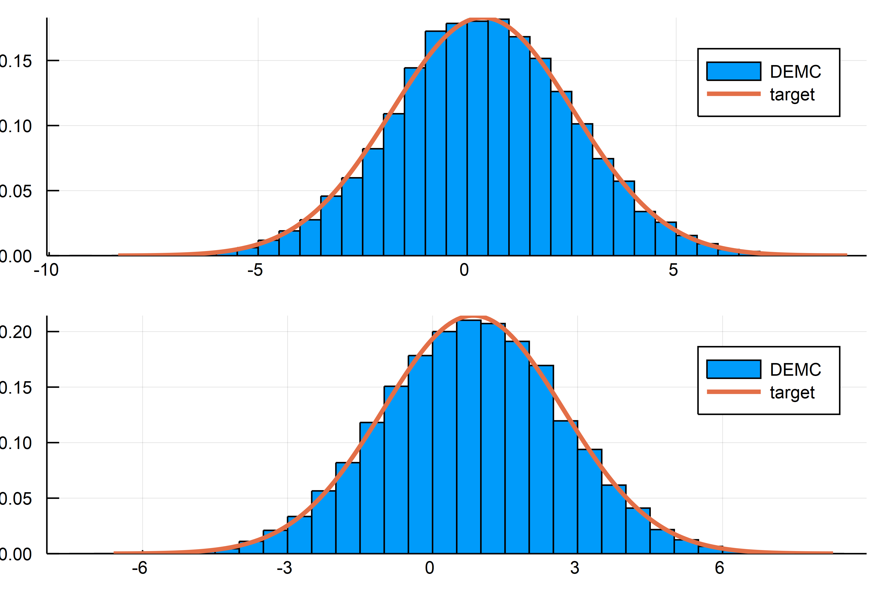

# DEMCMC - Differential Evolution Markov Chain Monte Carlo simulation


[](https://travis-ci.org/chrished/DEMCMC.jl)

[](https://coveralls.io/github/chrished/DEMCMC.jl?branch=master)

[](http://codecov.io/github/chrished/DEMCMC.jl?branch=master)


This repository contains
* implementation of the "DE-MCMC" algorithm proposed by Ter Braak (2006).
* parallelized computation of "DE-MCMC" algorithm (parallel over the different chains)
* convergence check: R̂ statistic as in Gelman et al. (2014).
* convenience function to display trace of obj function value in simulation, convergence check and acceptance ratios
* convenience function to calculate mean and covariance of simulated chains


## Sample Usage
For a self-contained example see `normal_direct_example.jl` in the example directory.

One example run for simulating a Multivariate Normal gives the following simulated densities for dimension 1 and 2. The figure was created by the `normal_direct_example.jl` script. Check there for details.


Here the main setup, you only need to supply your objective function and set the right number of parameters.

```julia
using DEMCMC

# log_obj(x)::Function is the log likelihood which accepts a vector x of length Npar as its argument
Npar = 3 # this is the length of the parameter vector.

# setup parameters for chain
Npop = 3*Npar # this should be larger than ndim
pop_guess = randn((Npop, Npar)) # random guess to start the markov chain (this should be sufficiently dispersed to cover the relevant parameter range)
# Number of iterations in Chain
Ngeneration  = 1000
blockindex = [1:ndim] # parameter blocks: here choose all parameters to be updated simultaenously
eps_scale = 1e-4*ones(Npar) # scale of random error around DE update
γ = 2.38 # scale of DE update, 2.38 is the "optimal" number for a normal
# run chain
demc = demc_sample(log_obj, pop_guess, Ngeneration, blockindex, eps_scale, γ)
# one can also use a previous run of a chain as a starting point
demc_2ndrun = demc_sample(log_obj, demc, Ngeneration, blockindex, eps_scale, γ)
# did we converge?
Rhat = DEMCMC.Rhat_gelman(demc_2ndrun.chain, Npop, Ngeneration, Npar)
```


## References

Gelman, A., Carlin, J. B., Stern, H. S., Dunson, D. B., Vehtari, A., & Rubin, D. B. (2014). Bayesian data analysis (Vol. 2). Boca Raton, FL: CRC press.

Ter Braak, C. J. (2006). A Markov Chain Monte Carlo version of the genetic algorithm Differential Evolution: easy Bayesian computing for real parameter spaces. Statistics and Computing, 16(3), 239-249.
