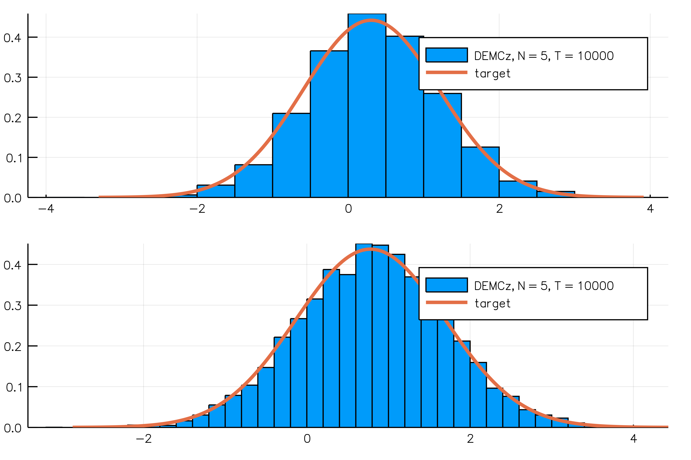

# DEMC - Differential Evolution Markov Chain


[](https://travis-ci.org/chrished/DEMC.jl)

[](https://coveralls.io/github/chrished/DEMC.jl?branch=master)

[](http://codecov.io/github/chrished/DEMC.jl?branch=master)


This repository contains
* implementation of the "DEMC" algorithm proposed by Ter Braak (2006).
* implementation of the "DEMCz"  algorithm proposed in Ter Braak and Vrugt (2008)
* convergence check: R̂ statistic as in Gelman et al. (2014).
* convenience function to display trace of obj function value in simulation, convergence check and acceptance ratios
* convenience function to calculate mean and covariance of simulated chains


## Sample Usage
See `normal_direct_demcz.jl` in the example directory.

One example run for simulating a Multivariate Normal gives the following simulated densities for dimension 1 and 2. The figure was created by the `normal_direct_demcz.jl` script. Check there for details.


Here the main setup, you only need to supply your objective function and set the right number of parameters.

```julia
using Distributions
using DEMC

# set up target distribution: Multivariate Normal
ndim = 50 # Number of dimensions
μ = rand(ndim) # mean of each dimension
A = rand((ndim, ndim))
Σ = A'*A + diagm(3*ones(ndim)) # variance covariance matrix
Σ = Σ./maximum(Σ)
distr = MvNormal(μ, Σ)
# log objective function
log_obj(mean) = log(pdf(MvNormal(μ, Σ), mean))

# set up of DEMCz chain
Npar = length(μ)
blockindex = [1:Npar] # parameter blocks: here choose all parameters to be updated simultaenously
Nblocks = length(blockindex)
eps_scale = 1e-5*ones(Npar) # scale of random error around DE update
γ = 2.38 # scale of DE update, 2.38 is the "optimal" number for a normal distribution
N = 5
K = 10
Z = randn((10*ndim, ndim)) - 1.

# Number of iterations in Chain
Nburn = 10000
Ngeneration  = 10000

mc_burn = DEMC.demcz_sample(log_obj, Z, N, K, Nburn, Nblocks, blockindex, eps_scale, γ)
chainflat = DEMC.flatten_chain(mc_burn.chain, N, Nburn, Npar)'
Z = chainflat[end-100*ndim+1:end, :] # new initial Z

mc = DEMC.demcz_sample(log_obj, Z, N, K, Ngeneration, Nblocks, blockindex, eps_scale, γ)


# Did we converge?
accept_ratio, Rhat, p_trace = convergence_check(mc.chain, mc.log_obj, N, Ngeneration, Npar, "./img/demcz_normal/" ; verbose = true)
```


## References

Gelman, A., Carlin, J. B., Stern, H. S., Dunson, D. B., Vehtari, A., & Rubin, D. B. (2014). Bayesian data analysis (Vol. 2). Boca Raton, FL: CRC press.

Ter Braak, Cajo JF (2006). A Markov Chain Monte Carlo version of the genetic algorithm Differential Evolution: easy Bayesian computing for real parameter spaces. Statistics and Computing, 16(3), 239-249.

ter Braak, Cajo JF, and Jasper A. Vrugt. "Differential evolution Markov chain with snooker updater and fewer chains." Statistics and Computing 18.4 (2008): 435-446.
